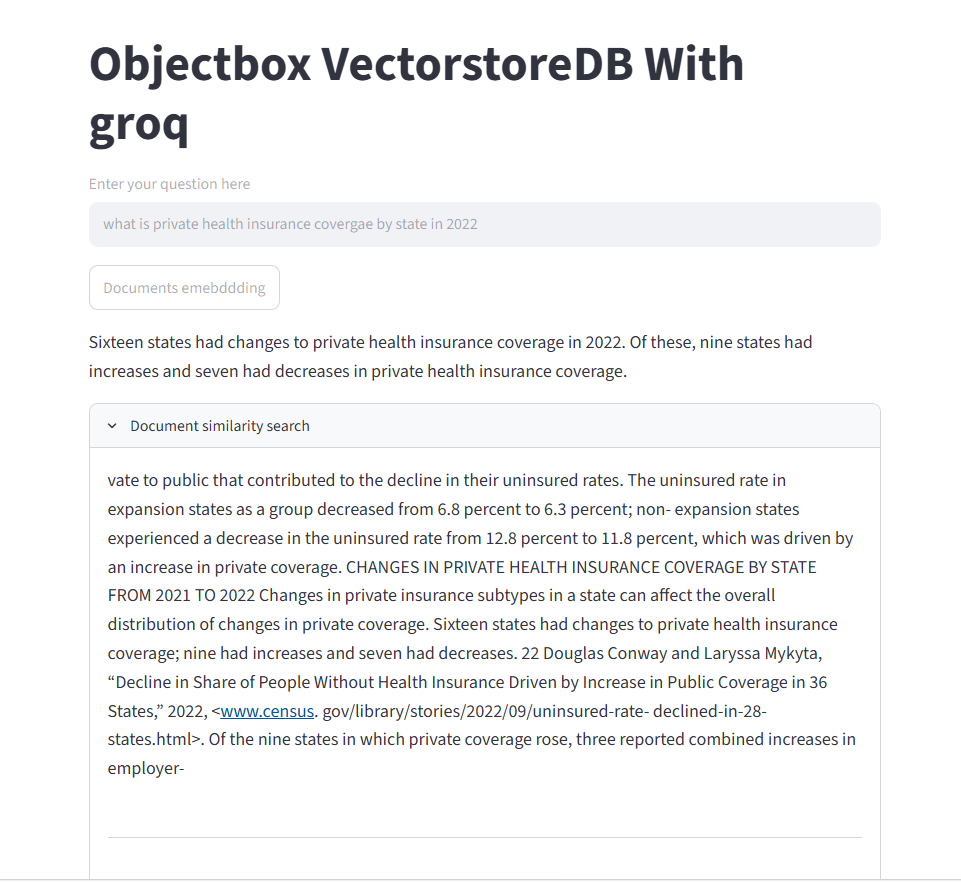

# 📦 ObjectBox Vector-RAG Studio

> A high-performance, low-latency Retrieval-Augmented Generation (RAG) platform designed to ingest, vectorize, and query dense document corpora (such as US Census data) locally. The system leverages a cutting-edge hybrid AI architecture: **Google Gemini-2** for high-fidelity text embeddings, **ObjectBox** as an ultra-fast embedded vector database, and **Groq (Llama 3.1)** for sub-second text generation and synthesis.

---

## 📋 Core Architectural Pipeline

The application parses unstructured PDF documentation and routes context through a highly optimized data-ingestion and inference loop:

* 📑 **Document Ingestion & Fragmenting:** Scans local directories using a `PyPDFDirectoryLoader` to extract text data, passing it through a `RecursiveCharacterTextSplitter` configured with a token layout chunk size of `1000` and a `200` token overlap for strict contextual retention.
* 📐 **High-Dimensional Embedding Vectorization:** Standardizes document fragments into 768-dimensional vector spaces utilizing the enterprise-grade `models/gemini-embedding-2` engine.
* 🗄️ **On-Device Vector Storage Indexing:** Caches and indexes vector dimensions inside an **ObjectBox database**—an edge-optimized, high-speed transactional object database that eliminates the networking overhead of cloud-based vector alternatives.
* ⚡ **Accelerated Context Retrieval & Synthesis:** Extracts semantic fragments via an integrated retriever chain and pipes them to **Groq's Llama-3.1-8b-instant** hardware matrix to synthesize precise, context-isolated answers.

---

## ✨ Features

* **Sub-Second LLM Responses:** Harnesses Groq's LPU (Language Processing Unit) architecture to deliver lightning-fast response times, completely bypassing standard API processing delays.
* **Embedded Vector Architecture:** Uses ObjectBox to handle semantic indexing directly on-device, offering high data privacy and avoiding complex cloud-hosting setups.
* **Strict Context Boundary Enforcement:** System prompts isolate the LLM's knowledge base purely to the provided document context, mitigating hallucinations and grounding responses in facts.
* **Persistent Session State:** Utilizes Streamlit's structural memory caching (`st.session_state`) to preserve the embedded data index across user interactions, eliminating redundant processing loops.

---

## 🛠️ Tech Stack & Dependencies

| Layer Component | Technology Chosen | Purpose |
| :--- | :--- | :--- |
| **Frontend Layout** | Streamlit | Minimalist, single-pane input/output user dashboard. |
| **Inference Compute** | Groq (Llama-3.1-8b-instant) | High-speed semantic text generation and token streaming. |
| **Vector Indexing** | ObjectBox DB | Low-overhead, ultra-fast embedded vector search database. |
| **Embedding Engine** | Google GenAI (`gemini-embedding-2`) | Transforms raw text chunks into 768-dimension semantic arrays. |
| **Orchestration** | LangChain Framework | Handles chunking strategies, prompt templating, and retrieval chains. |

---

## 📂 Project Directory Structure

```text
ObjectBox-Groq-RAG/
│
├── us_census/          # Target folder housing source PDF documentation
├── app.py              # Core application code, UI layout, and RAG logic
├── .env                # Protected hardware credentials and API tokens
├── requirements.txt    # Declared environment package definitions
└── README.md           # Repository documentation page
```
<p align="center">
  
</p>
